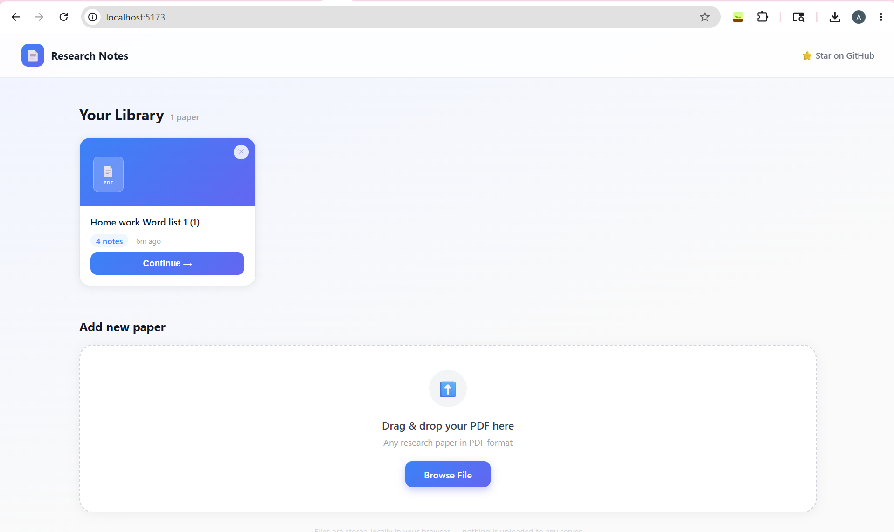
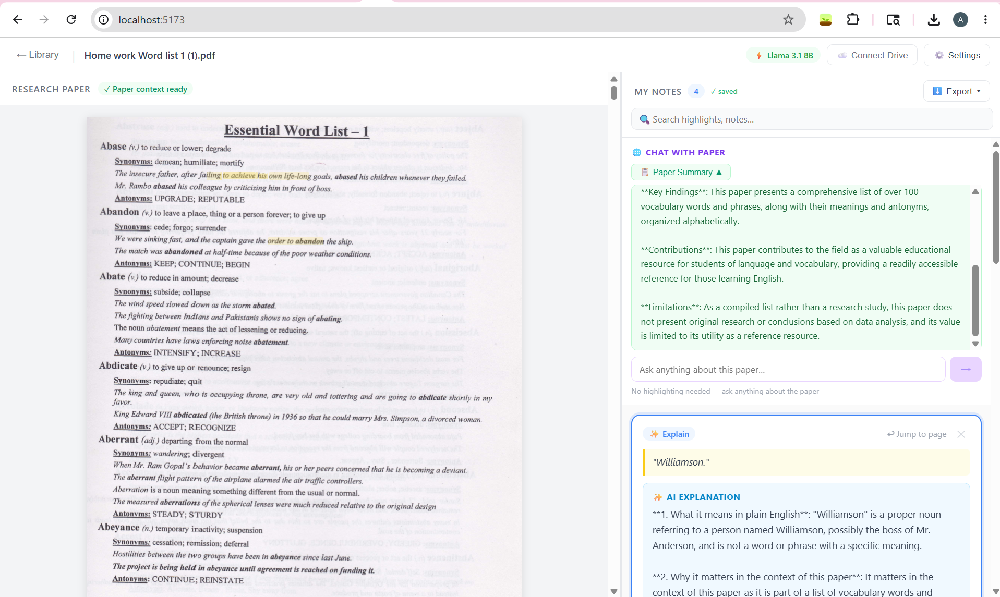
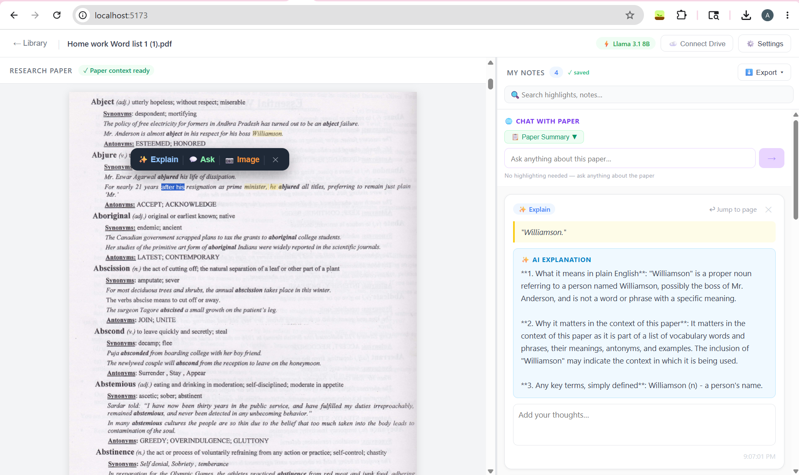
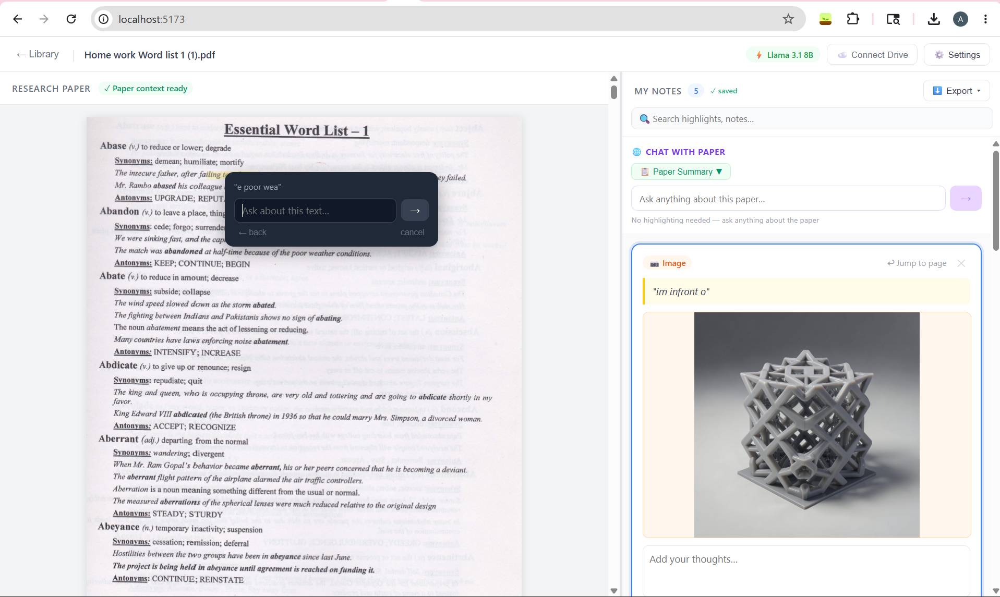
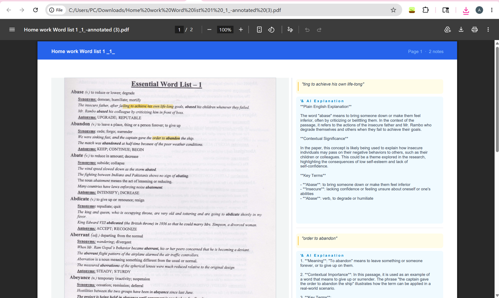
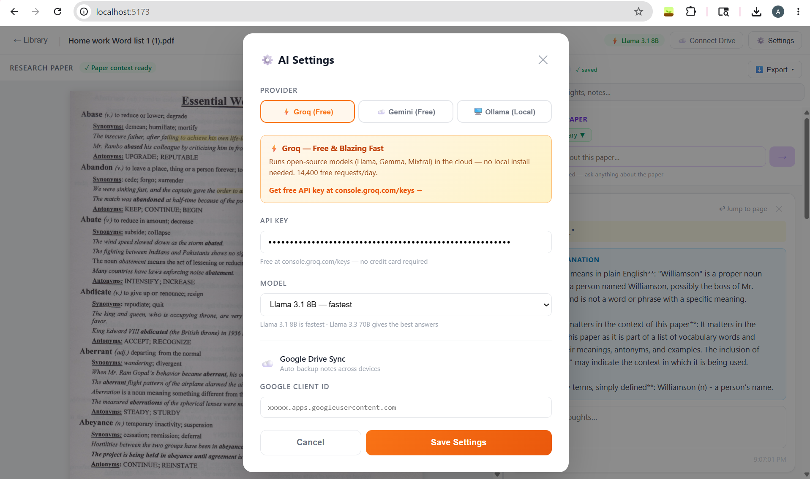

# 📄 Research Notes

> An AI-powered research paper reading tool — highlight text, get instant explanations, ask questions, and export your annotated notes.

   

**[🚀 Live Demo →](https://your-app.vercel.app)** &nbsp;|&nbsp; **[⭐ Star this repo](https://github.com/your-username/research-notes-app)**

---

## 📸 Screenshots

> **Tip for contributors:** Replace these placeholders with real screenshots after running `npm run dev`.

| Home — Paper Library | Reader — Split Panel |
|---|---|
|  |  |

| Highlight → Explain | Highlight → Ask |
|---|---|
|  |  |

| Export — Paper + Notes PDF | Settings — Ollama Install |
|---|---|
|  |  |

---

## ✨ Features

**Paper Library**
- Drag & drop PDFs or browse to upload
- Papers are stored locally in your browser (IndexedDB) — no re-uploading ever
- See note count and last-opened time for each paper
- Click "Continue →" to pick up exactly where you left off

**Reading & Annotations**
- Split-panel view: PDF on the left, notes panel on the right
- Select any text → **✨ Explain** for a plain-English AI explanation
- Select any text → **💬 Ask** to type a custom question about the passage
- AI uses the full page text as context (not just your selection) for better answers
- Yellow highlights = Explain notes · Green highlights = Ask notes
- Click any highlight to jump to its note; click any note to jump to that page

**AI Providers**
- **Ollama (local)** — free, unlimited, private; install any model directly from the app
- **Gemini (cloud)** — 1500 free requests/day with a Google AI Studio key
- Explain and Ask prompts both include surrounding page context for accuracy

**Persistence & Sync**
- Notes auto-save to localStorage on every keystroke
- PDFs stored in IndexedDB — reopen without uploading again
- Optional **Google Drive sync** — notes back up automatically across devices

**Search & Export**
- Live search across all notes (highlights + AI explanations + your own text)
- **📰 Paper + Notes PDF** — landscape A4 with paper page on left, notes on right
- **📄 Notes-only PDF** — clean formatted PDF of all annotations
- **📝 Word (.docx)** — styled Word document
- **🗒️ Markdown (.md)** — plain-text, ready for Obsidian/Notion

---

## 🚀 Getting Started

### Prerequisites
- [Node.js](https://nodejs.org) v18+
- npm v9+

### Run locally

```bash
git clone https://github.com/your-username/research-notes-app.git
cd research-notes-app/research-notes-app
npm install
npm run dev
```

Open **http://localhost:5173**

---

## 🤖 AI Setup

Click **⚙️ Settings** inside the app.

### Option A — Ollama (Recommended: free, local, private)

1. Install [Ollama](https://ollama.com) and run `ollama serve`
2. In Settings → pick a model → click **⬇ Install Model** (downloads in the background)
3. Click **Save Settings** — you're done

Recommended models for research papers:
| Model | Size | Best for |
|---|---|---|
| `llama3.2` | 3B | Speed (good enough for most explanations) |
| `llama3.3` | 8B | Quality (best answers, needs more RAM) |
| `phi4-mini` | 3.8B | Very fast, surprisingly good |

### Option B — Gemini (cloud)

1. Get a free API key at [aistudio.google.com/apikey](https://aistudio.google.com/apikey) — no credit card
2. Paste it in Settings → Gemini → API Key
3. **Free tier:** 1500 requests/day with Gemini 2.5 Flash

---

## ☁️ Google Drive Sync (optional)

Automatically backs up all your notes to your Google Drive so they're available on any device.

**5-minute setup:**
1. Go to [console.cloud.google.com](https://console.cloud.google.com) → New Project
2. **APIs & Services** → Enable → search "Google Drive API" → Enable
3. **Credentials** → Create → OAuth 2.0 Client ID → Web Application
4. Add `http://localhost:5173` (and your Vercel URL) to **Authorised JavaScript origins**
5. Copy the Client ID → paste it in **⚙️ Settings → Google Drive Client ID** → Save
6. Click **☁️ Connect Drive** in the reader top bar → sign in → done

Notes are stored in your Google Drive's hidden App Data folder (not visible in the Drive UI, only this app can access them).

---

## 🌐 Deploy for others to use

### Vercel (recommended — free)

```bash
npm install -g vercel
cd research-notes-app
vercel --prod
```

Vercel auto-detects the Vite build. Your app is live in ~60 seconds at a `*.vercel.app` URL.

After deploying, add your Vercel URL to the **Authorised JavaScript origins** in your Google Cloud Console if you're using Drive sync.

### Netlify

```bash
npm install -g netlify-cli
cd research-notes-app
netlify deploy --prod --dir dist
```

### GitHub Pages

```bash
npm run build
# then push the /dist folder to the gh-pages branch
```

Add `base: '/research-notes-app/'` to `vite.config.ts` first.

---

## 🗂️ Project Structure

```
research-notes-app/
├── src/
│   ├── components/
│   │   ├── Layout/
│   │   │   ├── SplitPanel.jsx      # Notes state, localStorage + Drive sync, search, export
│   │   │   ├── LeftPanel.jsx       # PDF viewer wrapper
│   │   │   └── RightPanel.jsx      # Notes panel with search + Ask/Explain badges
│   │   ├── PdfViewer/
│   │   │   └── PdfViewer.jsx       # PDF rendering, text selection, Explain/Ask tooltip, page-text extraction
│   │   └── Settings/
│   │       └── SettingsPanel.jsx   # AI provider config, Ollama model installer, Drive setup
│   ├── pages/
│   │   ├── Home.jsx                # Paper library grid + upload zone
│   │   └── Reader.jsx              # Reader shell, Drive connect button, top bar
│   ├── services/
│   │   ├── aiService.js            # Gemini + Ollama + Ollama model pull
│   │   └── driveService.js         # Google Drive OAuth + notes sync
│   └── utils/
│       ├── paperStore.js           # IndexedDB save/load/list/delete PDFs
│       └── exportNotes.js          # PDF, DOCX, Markdown, Paper+Notes PDF export
└── App.tsx                         # Root — library ↔ reader navigation
```

---

## 🛠️ Tech Stack

| Tool | Purpose |
|---|---|
| React 19 | UI |
| Vite 8 | Build tool |
| react-pdf / pdfjs-dist | PDF rendering + text layer |
| Tailwind CSS v4 | Styling |
| jsPDF | PDF export |
| docx | Word document export |
| IndexedDB | PDF file storage |
| Google Identity Services | Drive OAuth |
| Gemini API | Cloud AI |
| Ollama | Local AI |

---

## 🗺️ Roadmap

- [x] PDF upload + split-panel viewer
- [x] Text selection, highlights, notes panel
- [x] AI explanations (Gemini + Ollama)
- [x] localStorage persistence
- [x] Export — PDF, DOCX, Markdown, Paper+Notes PDF
- [x] Search notes
- [x] Paper library (IndexedDB — never re-upload)
- [x] Explain + Ask tooltip with page context
- [x] Ollama model installer inside the app
- [x] Google Drive sync (notes backup)
- [ ] Supabase sync (cloud DB for multi-device notes)
- [ ] Shared annotations (collaborate on a paper)
- [ ] Browser extension for web articles

---

## 🤝 Contributing

PRs are welcome! Please open an issue first for major changes.

```bash
git checkout -b feature/my-feature
git commit -m "feat: describe what you added"
git push origin feature/my-feature
# open a Pull Request
```

---

## 📄 License

MIT — free to use, modify, and distribute.
